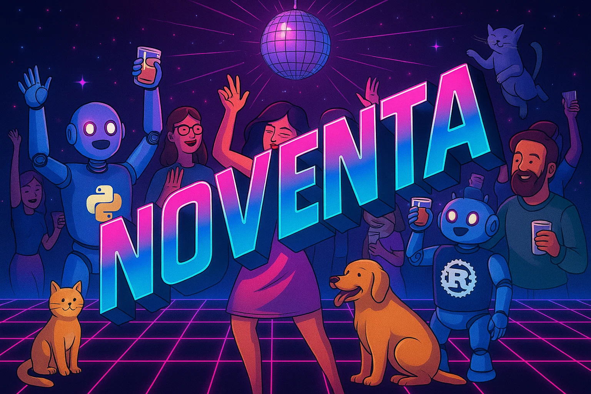

---

## 🪩 The Web Framework That Feels Like a Party for Developers

**Noventa** is more than just a framework — it’s a *vibe*.
Designed for creators, builders, and dreamers who want to ship things that work beautifully **without fighting the framework**.

Built with **AI UX as the first-class citizen**, Noventa is engineered so that **AI Agents understand, collaborate, and code with you**. Whether you’re building alone or with AI pair programmers, Noventa helps you move from idea → code → IPO effortlessly.

---

## ⚡ Why Noventa?

💫 **AI-First Design Philosophy**
Crafted so AI tools can understand, generate, and refactor code within Noventa with high accuracy. Perfect for “vibe coding” or AI-assisted dev sessions.

🚀 **Blazing Fast Core**
Rust powers the core — giving you **low overhead**, **strong safety**, and **ridiculous performance**.

🐍 **Python for the Flow**
Business logic, integrations, and app orchestration are written in Python — expressive, friendly, and deeply flexible.

🔒 **Secure & Production-Ready**
Modern security baked in. Ship confidently from prototype to production.

🌈 **Opinionated Yet Inclusive**
Noventa doesn’t aim to fit every use case — and that’s a feature. With minimal setup, you’ll have a stunning, app that just *feels right*.

🎶 **Feels Like a Party**
Coding should feel creative, collaborative, and energizing. Noventa turns your workflow into a jam session — quick iterations, colorful outcomes, and a little bit of disco magic.

---

## 🧠 Philosophy

Noventa is for the **90%** — the people who want to build, not over-engineer.
We believe:

* Code should be **expressive**, not exhausting.
* Frameworks should **help**, not dictate.
* AI and humans can **co-create**, not compete.
* Every developer deserves to **enjoy** the process.

---

## 🪄 Core Features

| Feature                   | Description                                                   |
| ------------------------- | ------------------------------------------------------------- |
| 🧩 **AI UX Native**       | Optimized so AI understands structure, naming, and context.   |
| ⚙️ **Rust Core**          | High-performance, low-overhead engine for speed and safety.   |
| 🐍 **Python Logic Layer** | Friendly syntax and easy integration with data science tools. |
| 🛡️ **Secure by Default** | Built with security best practices out of the box.            |
| 🧠 **Reactive & Smart**   | State management that just works — no boilerplate.            |
| 🎨 **Batteries Included** | Templates, components, and tools ready to go.                 |

---

## 🏁 Quick Start

```bash
# Install Noventa (example command)
pip install noventa

# Create a new project
noventa new my-cool-app

# Run the development server
cd my-cool-app
noventa dev
```

Visit **[http://localhost:9000](http://localhost:9000)** and start the party. 🎈

---

## 🌍 Community & Vibes

Join the **Noventa Movement**:

* 💬 Chat with other vibecoders
* 🧑‍💻 Share your builds and ideas
* 🎁 Contribute — everyone’s welcome

> “Noventa is the sound of code that *feels good*.”

---

## 🪅 License

Licensed under the **MIT License**.
Use it, remix it, share it — just don’t forget to dance a little while coding. 💃🕺

---

## 💖 A Note from the Team

Noventa is built for joy — for the *90% of us* who just want tools that get out of the way and let creativity shine. Whether you’re coding for work, art, or curiosity, we’re glad you’re here.

> **Noventa — because building should feel like a celebration.**

---